# Activity Diagrams — OSCA Senior Citizen Information System
## Bayan ng Juban, Lalawigan ng Sorsogon

---

## 1. User Authentication & Login

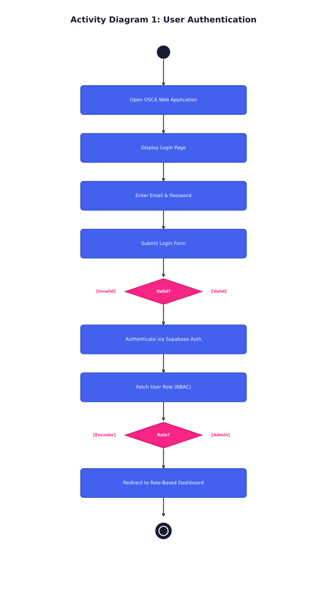

**Description:** The user opens the OSCA web application and is presented with the login page. After entering credentials (email & password), the system validates them via Supabase Auth. If valid, the user's role is fetched (Encoder, Supervisor, or Super Admin) and they are redirected to the appropriate role-based dashboard. Invalid credentials display an error message.

---

## 2. Senior Citizen Registration (NCSC-SCDF v4.0b3)

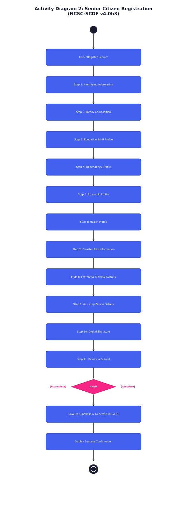

**Description:** The Encoder initiates a new registration by completing an 11-step form compliant with NCSC-SCDF v4.0b3 standards. Steps include: Identifying Information, Family Composition, Education & HR Profile, Dependency Profile, Economic Profile, Health Profile, Disaster Risk Information, Biometrics & Photo Capture, Assisting Person Details, Digital Signature, and Review & Submit. Upon successful validation, data is saved to Supabase and a unique OSCA ID is generated.

---

## 3. Fingerprint Biometrics (Capture & Verify)

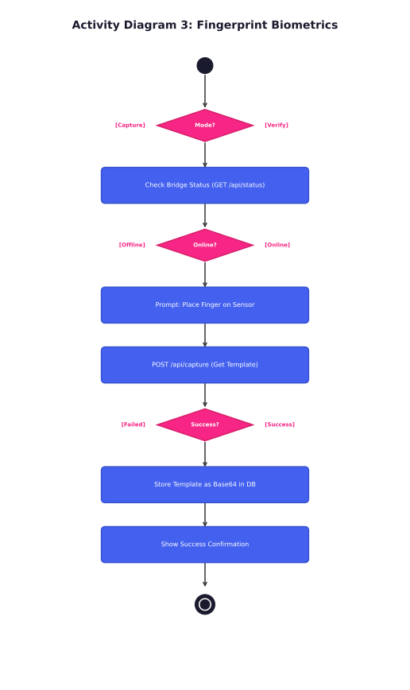

**Description:** The system communicates with the .NET 8 Fingerprint Bridge Service via REST API. For **capture**, the sensor reads the fingerprint and stores the template as Base64 in the database. For **verification**, the stored template is compared against a live scan. The bridge must be online (checked via `GET /api/status`) before any operation.

---

## 4. NFC ID Card Generation

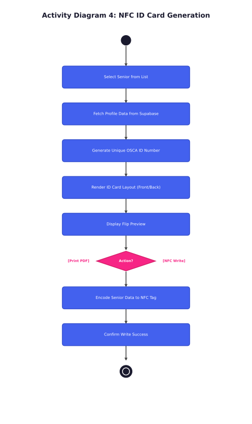

**Description:** An authorized user selects a registered senior citizen, fetches their profile data, generates a unique OSCA ID number, and renders the ID card layout (front and back). The card can be previewed with a flip animation. The user can then either print the card as PDF or initiate NFC write simulation to encode data onto a physical NFC tag.

---

## 5. PDF Form Generation

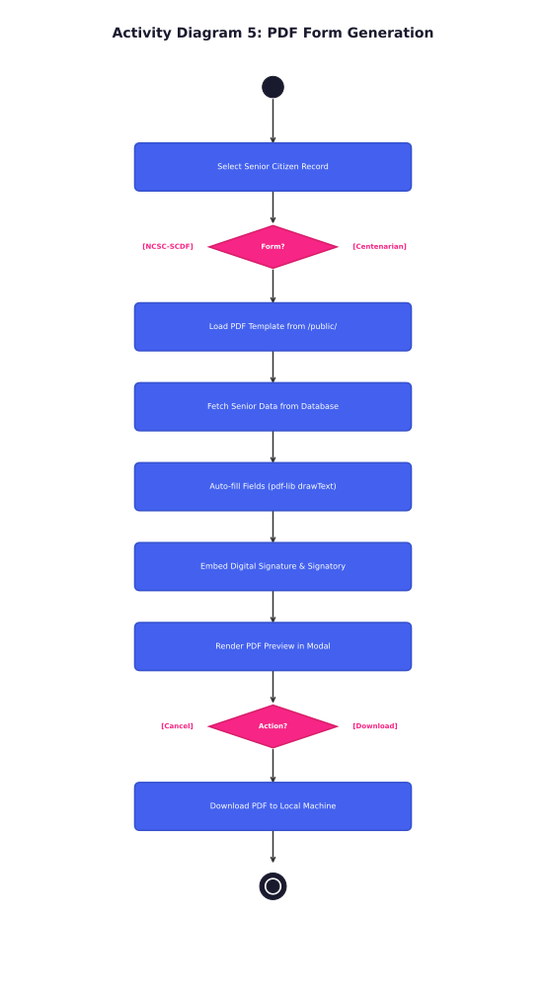

**Description:** The system supports two PDF forms: the **NCSC-SCDF Form** (standard profiling) and the **Centenarian Honoring Grantee Claim Form** (for seniors aged 100+). The selected PDF template is loaded, senior data is auto-filled using `pdf-lib` (drawText overlay), digital signatures and signatory data are embedded, and the form is previewed before download.

---

## 6. SMS Notification Center

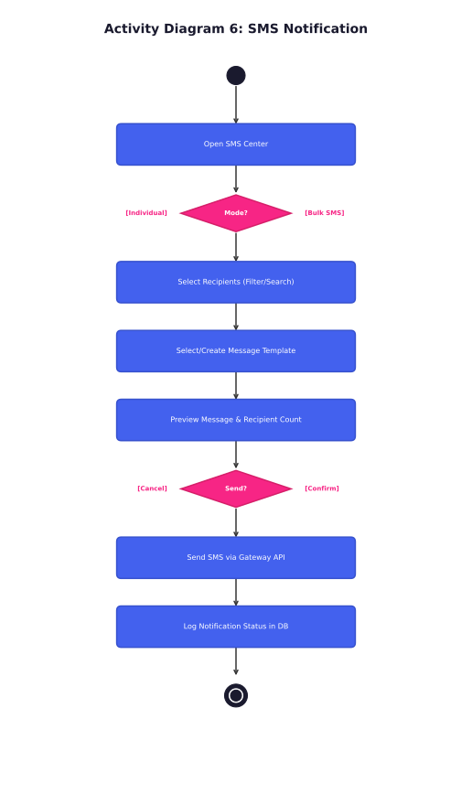

**Description:** Users can send either individual or bulk SMS notifications. For bulk SMS, recipients are selected by filter (barangay, age bracket, benefit status). A message template is selected or created (pension notice, vaccine schedule, medical mission, or custom). The message is previewed with recipient count, and upon confirmation, sent via the SMS gateway. Delivery status is logged in the database.

---

## 7. Dashboard & Analytics

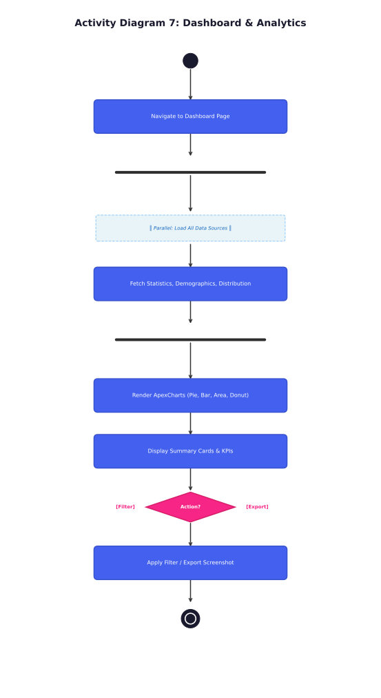

**Description:** The dashboard loads multiple data sources in parallel (total counts, demographics, distribution data). ApexCharts renders interactive visualizations including pie charts (gender), bar charts (age groups), area charts (monthly registrations), and donut charts (barangay distribution). Summary KPI cards display key statistics. Users can filter by barangay/date or export as screenshot/PDF.

---

## 8. GIS Mapping & Geotagging

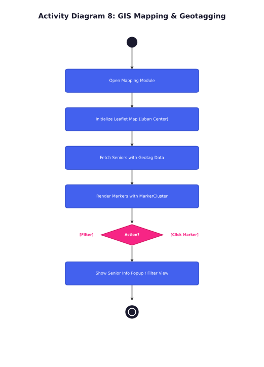

**Description:** The Leaflet-based interactive map initializes centered on Juban municipality. Senior citizen geotag data is fetched and rendered as clustered markers using MarkerCluster for efficient visualization. Users can click markers to view senior info popups, filter by barangay, or zoom/pan to explore spatial distribution.

---

## 9. Reports Module

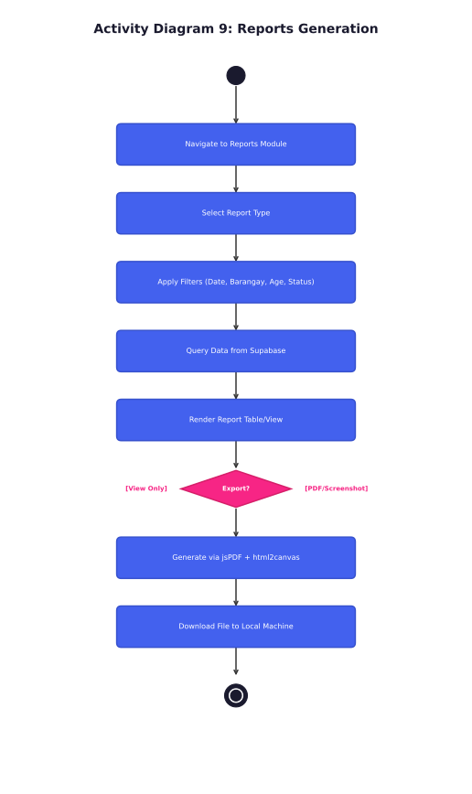

**Description:** The reports module supports multiple report types (Master List, Demographic Summary, Barangay Report, Benefit Report). Users apply filters (date range, barangay, age group, status), and data is queried from Supabase. Reports are rendered as tables and can be exported as PDF (via jsPDF + html2canvas) or screenshot (via modern-screenshot).

---

## 10. User & Role Management (Super Admin)

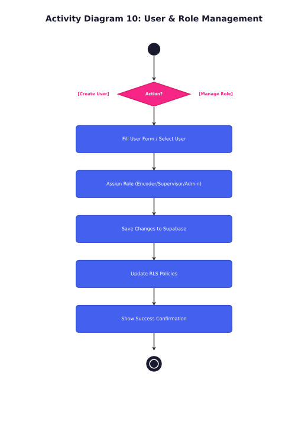

**Description:** The Super Admin can create new user accounts, update roles (Encoder, Supervisor, Super Admin), and manage document signatories. Changes are saved to Supabase and Row-Level Security (RLS) policies are updated accordingly to enforce proper access control.

---

## 11. System Overview (High-Level Flow)

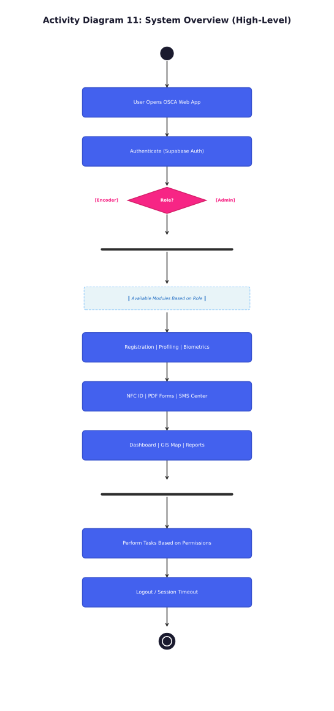

**Description:** High-level overview of the complete OSCA system. Users authenticate via Supabase, are routed by role, and access available modules (Registration, Profiling, Biometrics, NFC ID, PDF Forms, SMS, Dashboard, GIS Map, Reports). Each module enforces role-based permissions. Sessions end via logout or timeout.

---

## Legend

| Symbol | Meaning |
|--------|---------|
| ● (Filled Circle) | Initial Node — Start of activity |
| ◉ (Bull's Eye) | Final Node — End of activity |
| Blue Rounded Rectangle | Action State — A process/task |
| Pink Diamond | Decision Node — Branching logic |
| Black Bar | Fork/Join — Parallel activities |
| Dashed Blue Box | Note — Additional information |
| Arrow (→) | Control Flow — Transition between states |

---

## Summary Table

| # | Activity Diagram | Primary Actor(s) | Key Activities |
|---|-----------------|-------------------|----------------|
| 1 | User Authentication | All Users | Login, credential validation, RBAC routing |
| 2 | Senior Registration | Encoder | 11-step NCSC-SCDF form, data persistence |
| 3 | Fingerprint Biometrics | Encoder | Capture/verify via .NET Bridge REST API |
| 4 | NFC ID Card Generation | Encoder, Supervisor | Card rendering, NFC encoding |
| 5 | PDF Form Generation | Encoder, Supervisor | NCSC/Centenarian form auto-fill |
| 6 | SMS Notification | Supervisor, Admin | Individual/bulk SMS, templates |
| 7 | Dashboard & Analytics | All Users | Charts, KPIs, data filtering |
| 8 | GIS Mapping | All Users | Leaflet map, markers, clusters |
| 9 | Reports Module | Supervisor, Admin | Query, render, export reports |
| 10 | User & Role Management | Super Admin | CRUD users, assign roles, signatories |
| 11 | System Overview | All Users | End-to-end system flow |

---

*OSCA — Office for Senior Citizens Affairs*  
*Bayan ng Juban, Lalawigan ng Sorsogon*  
*Compliant with NCSC-SCDF v4.0b3 & RA 10173 (Data Privacy Act of 2012)*
