# OSCA — Bayan ng Juban Senior Citizen Information System

Ang **OSCA (Office for Senior Citizens Affairs) Information System** ay isang komprehensibo, moderno, at ligtas na web application para sa pamamahala ng profiling, e-Census, biometrics, NFC ID generation, PDF form generation, pamamahagi ng benepisyo, at ugnayan para sa mga nakatatandang mamamayan ng **Bayan ng Juban, Lalawigan ng Sorsogon**.

Sumusunod sa mga pamantayang **NCSC-SCDF v4.0b3** at **Data Privacy Act of 2012 (RA 10173)**.

---

## 📚 Documentation

| # | Document | Summary |
|---|----------|---------|
| 1 | [Activity Diagrams](./Activity.md) | Naglalaman ng **11 Activity Diagrams** na nagpapakita ng step-by-step na daloy ng bawat major system process — mula sa User Authentication, Senior Registration (11-step NCSC-SCDF), Fingerprint Biometrics, NFC ID Generation, PDF Form Generation, SMS Notification, Dashboard & Analytics, GIS Mapping, Reports Module, User & Role Management, hanggang sa System Overview. Kasama ang legend at summary table ng lahat ng diagrams. |
| 2 | [Entity Relationship Diagram (ERD)](./Entity.md) | Naglalaman ng **kompletong database schema** ng system gamit ang Mermaid ERD notation. Ipinapakita ang lahat ng 14 na tables (barangays, users, seniors, roles, benefits, centenarian_honoring, sms_logs, audit_logs, report_templates, document_signatories, user_sessions, user_settings, id_card_config, system_settings), ang kanilang columns at data types, at ang relationships/foreign keys sa pagitan ng mga entities. |
| 3 | [Methodology](./methodology.md) | Detalyadong dokumentasyon ng **development methodology** — kasama ang System Architecture (SPA + BaaS pattern), Technology Stack, Agile Iterative SDLC, Database Design, Security Implementation (authentication flow, RLS, audit trail), lahat ng System Modules (Registration, Centenarian Honoring, SMS, GIS, Dashboard, Reports, PDF, NFC, Configuration), State Management Strategy, Deployment & Infrastructure, UI Design Principles, Testing Strategy, at Compliance Standards. |
| 4 | [Use Case Diagram](./useCase.md) | Naglalaman ng **kompletong Use Case specification** — 6 Actors (Super Admin, MSWDO Officer, Barangay Encoder, Senior Citizen, System, Fingerprint Bridge), 10 Use Case modules na may 30+ individual use cases (UC-1 hanggang UC-10), «include»/«extend» relationships, Actor–Use Case Access Matrix, at Compliance Mapping sa NCSC-SCDF, RA 10173, RA 11982, at RA 9994. |
| 5 | [System Workflow](./workflow.md) | Komprehensibong **technical workflow documentation** — detalyadong architecture diagram, Authentication & Session Management flow, 11-step Registration Workflow (kasama ang component filenames), Senior Profiling & Management, Fingerprint Biometrics Bridge REST API, NFC ID Card Generation, PDF Form Generation (pdf-lib), Dashboard & Analytics, GIS Mapping, SMS Notification Center, Reports Module, RBAC Implementation, User & Configuration Management, Database Schema & Migrations (20 migration files), at State Management (Zustand stores). |
| 6 | [Sequence Diagrams](./docs/sequenceDiagram.md) | Naglalaman ng **26 na SVG Sequence Diagrams** na nagpapakita ng interaction flow sa pagitan ng components — kasama ang User Authentication, Session Validation & Auto-Refresh, Session Force-Termination, Senior Registration (11-step), Fingerprint Capture & Verification, Photo Capture (WebRTC), Digital Signature, Profile View & Edit, NFC ID Generation, NCSC PDF & Centenarian Form, Dashboard Data Loading, GIS Mapping, SMS Bulk Send, Reports Export, User Management, RBAC, Configuration & Signatories, Theme Persistence, Audit Logging, Search & Filter, Logout, App Cold Start, System Architecture Overview, at Data Flow Diagram. |

---

### 📁 Sub-module Documentation

| Document | Summary |
|----------|---------|
| [Fingerprint Bridge README](./fingerprint-bridge/README.md) | Setup at usage guide para sa .NET 8 Fingerprint Bridge Service — Windows Biometric Framework integration, REST API endpoints, at installation instructions. |
| [ESP32 Firmware README](./fingerprint-bridge/esp32-firmware/README.md) | Documentation para sa ESP32 microcontroller firmware na ginagamit sa fingerprint hardware sensor setup. |

---

## 🛠️ Technology Stack

| Layer | Technology |
|-------|-----------|
| **Frontend** | React 18 + TypeScript + Vite |
| **Styling** | Tailwind CSS 4 (Glassmorphism, Responsive) |
| **State Management** | Zustand |
| **Forms & Validation** | React Hook Form + Zod |
| **Backend / Database** | Supabase (Auth, PostgreSQL, Storage) |
| **Charts** | ApexCharts + react-apexcharts |
| **Mapping** | Leaflet + React-Leaflet + MarkerCluster |
| **PDF Generation** | pdf-lib (client-side form filling) |
| **Export / Screenshots** | html2canvas, modern-screenshot, jsPDF |
| **Animations** | Motion (Framer Motion) |
| **Icons** | Lucide React |
| **AI Integration** | Google GenAI SDK |
| **Biometrics** | Fingerprint Bridge (.NET 8 / Windows Hello) |

---

## ⚙️ Getting Started

### Prerequisites
- **Node.js** 18+
- **npm** o **pnpm**
- **.NET 8 SDK** (para sa Fingerprint Bridge)
- **Windows 10/11** na may fingerprint sensor (para sa biometrics)

### Frontend Development
```bash
# Install dependencies
npm install

# Start dev server (port 3000, accessible sa network)
npm run dev

# Production build
npm run build
```

### Fingerprint Bridge Service
```bash
cd fingerprint-bridge

# Run directly
dotnet run

# Or install as Windows Service (requires Admin)
install-as-service.bat
```

---

## 🌐 Network Configuration

| Service | URL |
|---------|-----|
| Frontend (Dev) | `http://192.168.8.34:3000` |
| Fingerprint Bridge | `http://192.168.8.34:8000` |
| Production | `https://me.oscajuban.online` |

---

## 🛡️ Security & Compliance

- **Data Privacy Act of 2012 (RA 10173)** — Lahat ng personal data ay pinangalagaan
- **RA 9994 (Expanded Senior Citizens Act)** — Sumusunod sa mga benepisyo at karapatan
- **RA 11982 (Centenarian Honoring)** — Digitalized Annex A claim form workflow
- Supabase Row-Level Security (RLS) para sa database access control
- Role-based access sa lahat ng endpoints at pages

---

## 🖥️ System UI Screenshots

Ang mga sumusunod na screenshots ay nagpapakita ng mga pangunahing interface ng OSCA Information System:

### Public Pages

| # | Screenshot | Description |
|---|-----------|-------------|
| 1 | 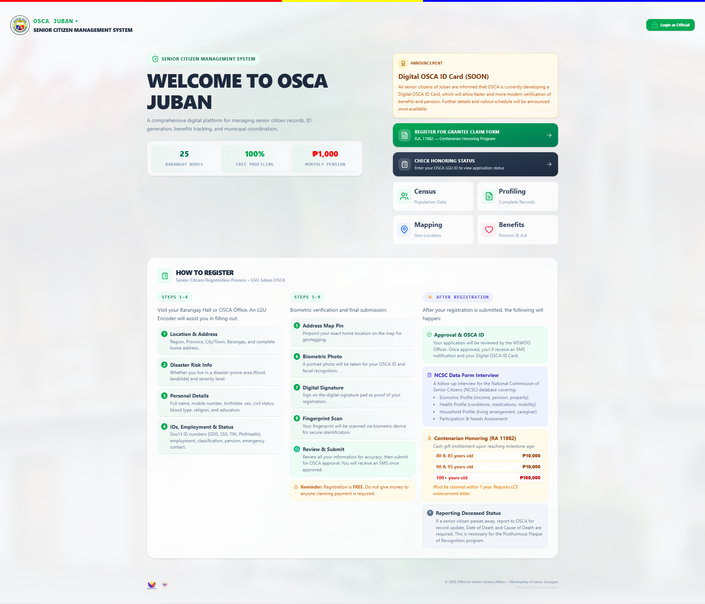 | **Landing Page** — Welcome page ng OSCA Juban system na nagpapakita ng announcements, quick links (Census, Profiling, Mapping, Benefits), at "How to Register" guide para sa senior citizens. |
| 2 | 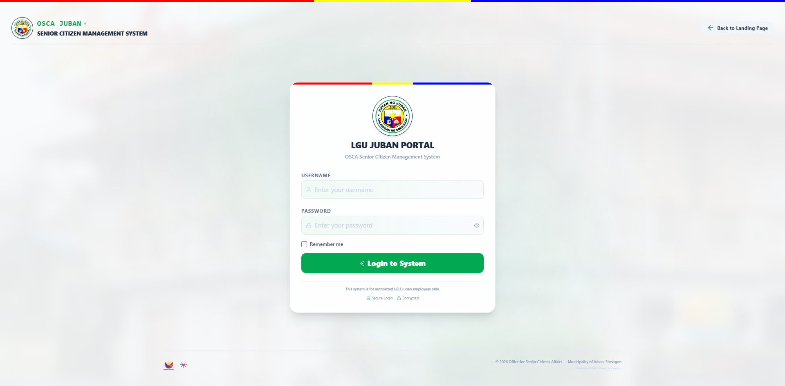 | **Login Page** — LGU Juban Portal login form para sa mga authorized system users (employees) na may secure at encrypted authentication. |
| 3 | 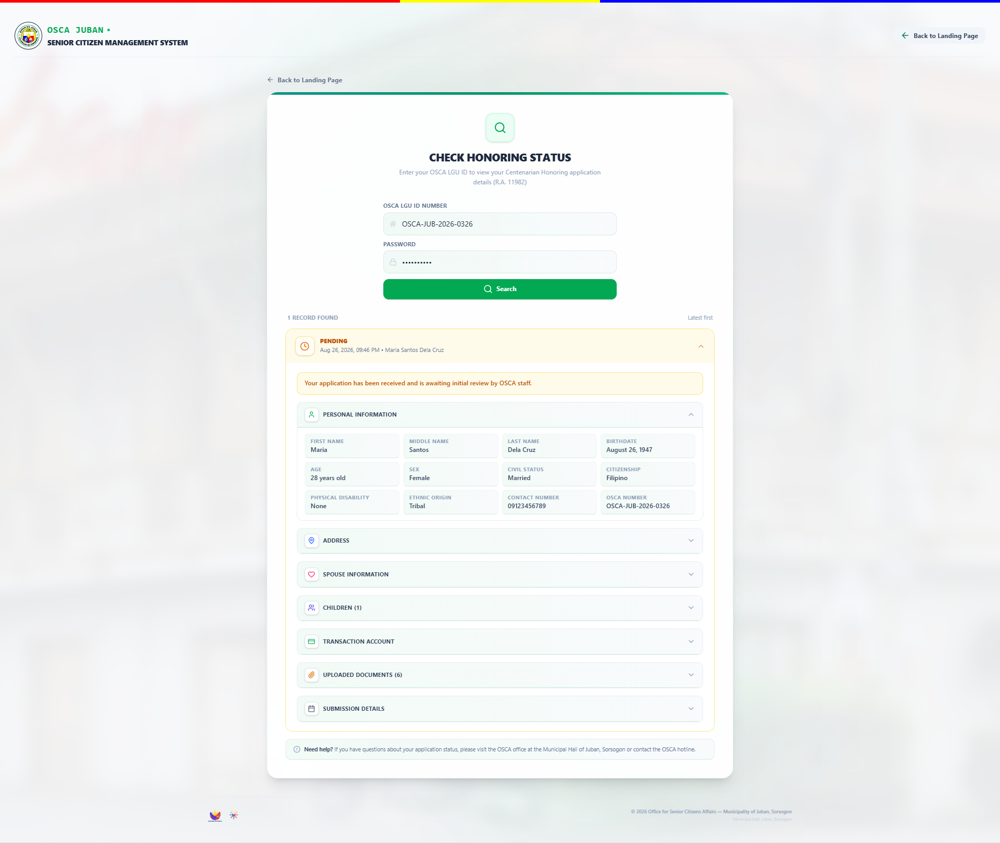 | **Check Honoring Status** — Public page kung saan maaaring i-check ng senior citizen ang status ng kanilang Centenarian Honoring application gamit ang OSCA LGU ID number. |

### Census Dashboard

| # | Screenshot | Description |
|---|-----------|-------------|
| 4 | 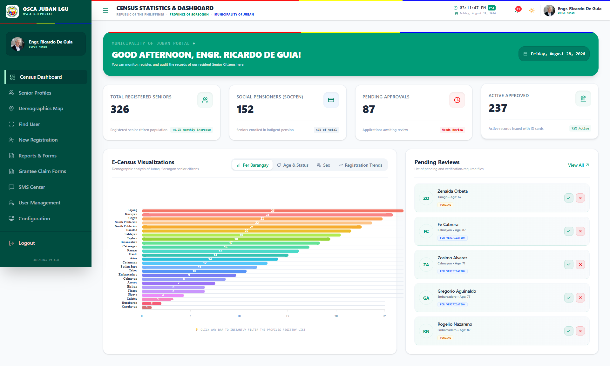 | **Census Statistics & Dashboard** — Main dashboard na nagpapakita ng total registered seniors, social pensioners (SOCPEN), pending approvals, active approved records, e-Census visualizations (bar charts per barangay), at pending reviews list. |

### Senior Profiles

| # | Screenshot | Description |
|---|-----------|-------------|
| 5 | 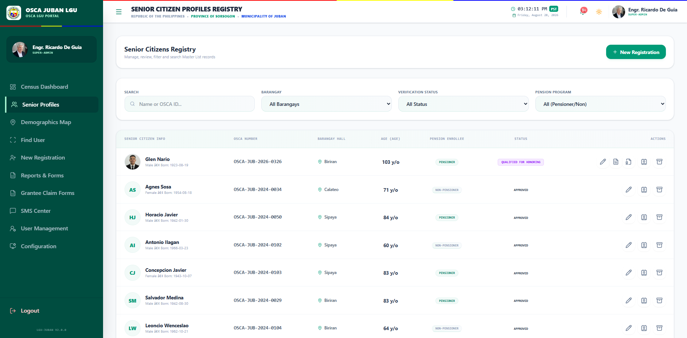 | **Senior Citizen Profiles Registry** — Master list ng lahat ng registered senior citizens na may search, filter (barangay, verification status, pension program), at action buttons (edit, view ID, delete). |

### Demographics Map

| # | Screenshot | Description |
|---|-----------|-------------|
| 6 | 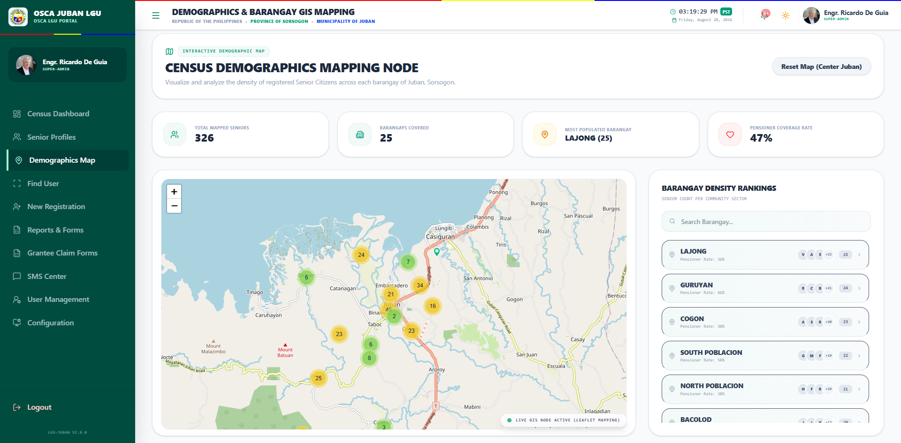 | **Demographics & Barangay GIS Mapping** — Interactive Leaflet map na nagpapakita ng density at distribution ng registered senior citizens sa bawat barangay ng Juban, kasama ang Barangay Density Rankings. |

### Find User & Biometric Scanner

| # | Screenshot | Description |
|---|-----------|-------------|
| 7 | 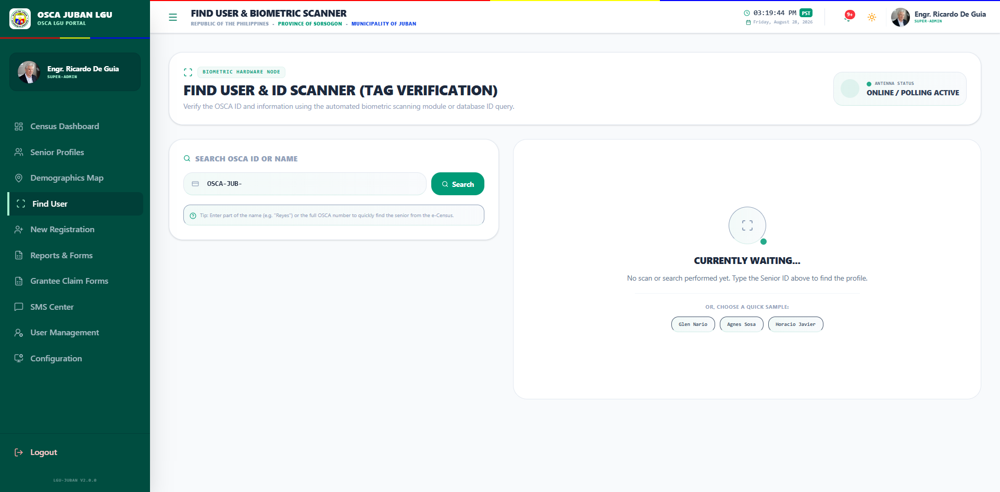 | **Find User & ID Scanner (Tag Verification)** — Biometric hardware node para sa paghahanap ng senior citizen gamit ang OSCA ID search o NFC tag scan, na may real-time antenna status indicator. |

### New Registration

| # | Screenshot | Description |
|---|-----------|-------------|
| 8 | 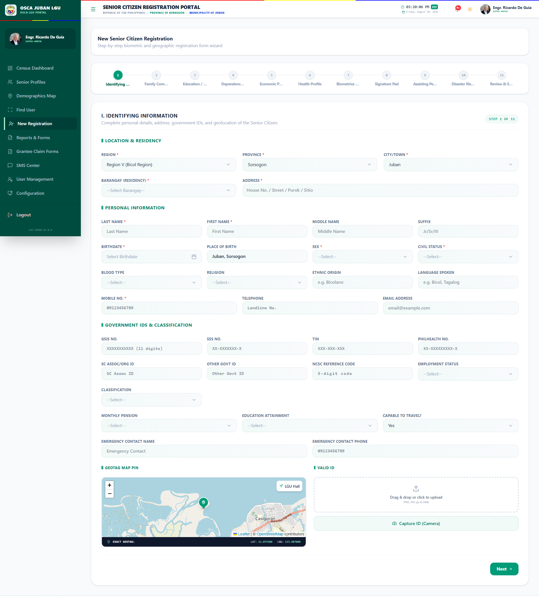 | **New Senior Citizen Registration (Step 1 of 11)** — Multi-step registration wizard na nagsisimula sa Identifying Information — Location & Residency, Personal Information, Government IDs, Geotag Map Pin, at Valid ID upload. |

### Reports & Forms

| # | Screenshot | Description |
|---|-----------|-------------|
| 9 | 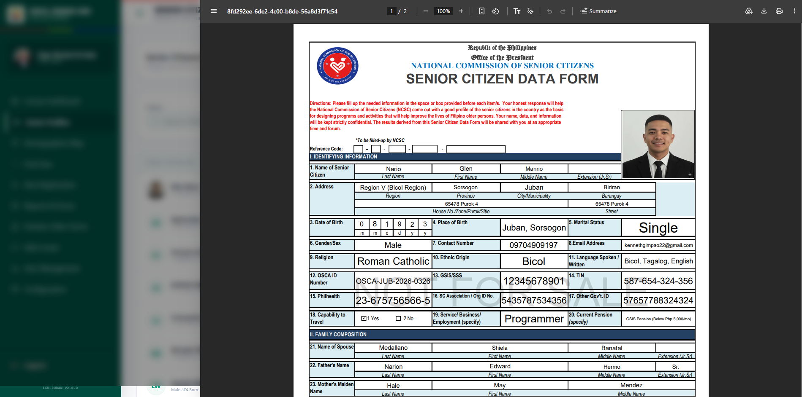 | **NCSC Senior Citizen Data Form (PDF)** — Auto-generated PDF form na naka-fill-up mula sa system data, ayon sa NCSC-SCDF v4.0b3 format. |

### Grantee Claim Forms

| # | Screenshot | Description |
|---|-----------|-------------|
| 10 | 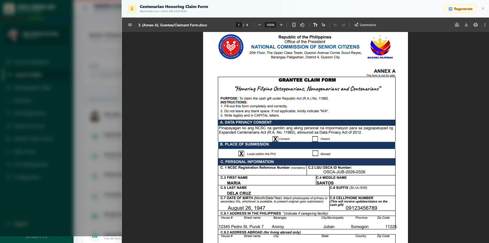 | **Centenarian Honoring Grantee Claim Form (Annex A)** — Auto-generated Annex A PDF document para sa R.A. 11982 Centenarian Honoring cash gift claim, na may Data Privacy Consent at complete personal information. |
| 11 | 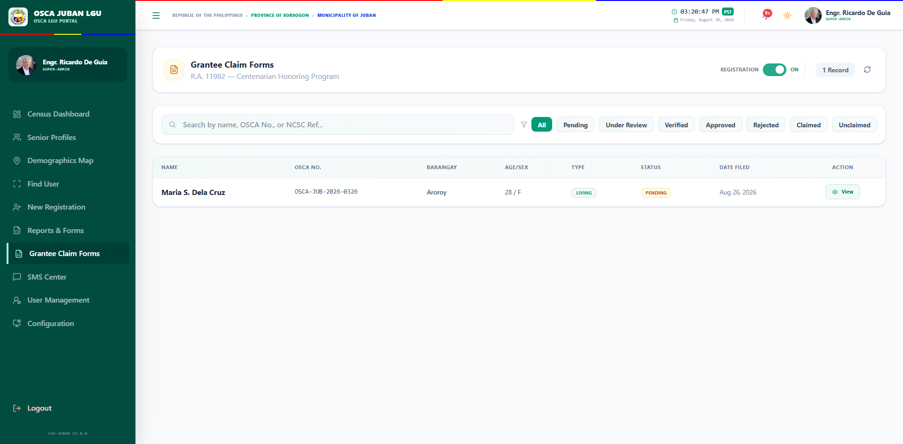 | **Grantee Claim Forms Management** — List ng lahat ng filed Centenarian Honoring claim forms na may status filters (Pending, Under Review, Verified, Approved, Rejected, Claimed, Unclaimed) at registration toggle. |

### SMS Center

| # | Screenshot | Description |
|---|-----------|-------------|
| 12 | 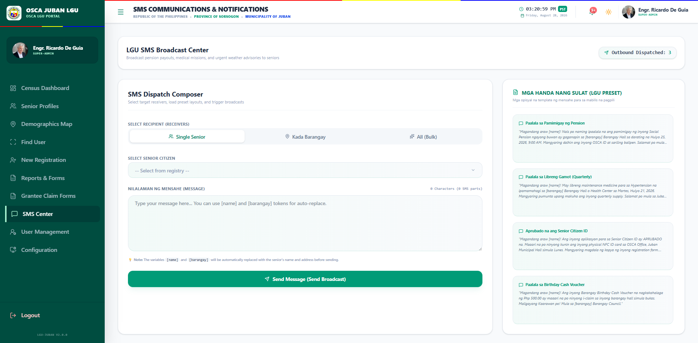 | **SMS Communications & Notifications** — LGU SMS Broadcast Center para sa pagpapadala ng pension payouts, medical missions, at urgent weather advisories sa single senior, per barangay, o all (bulk), kasama ang mga preset message templates. |

### User Management

| # | Screenshot | Description |
|---|-----------|-------------|
| 13 | .png) | **System User Administration — User Accounts** — Mga system user accounts (Barangay Encoders, General Viewers, MSWDO Officers, Super Admin) na may assigned barangay, contact info, at active status. |
| 14 | 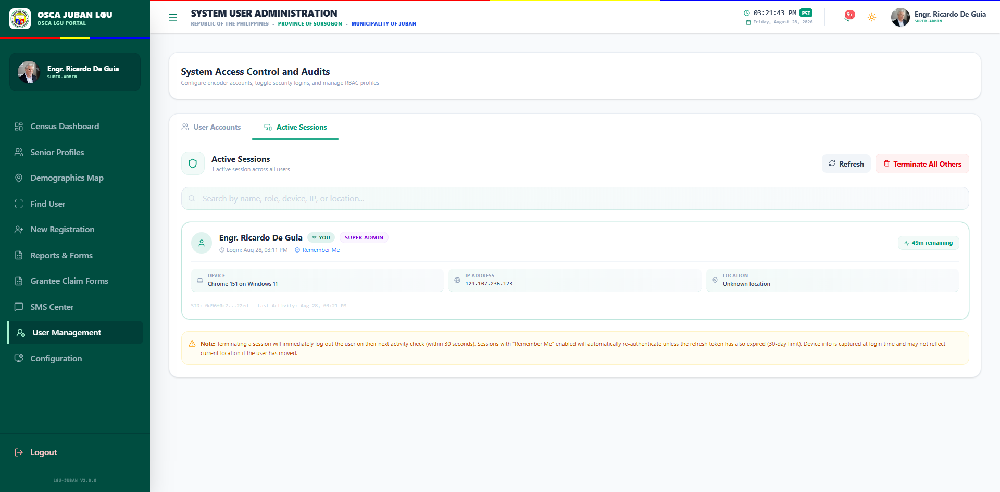 | **System User Administration — Active Sessions** — Real-time monitoring ng active user sessions na may device info, IP address, location, session expiry, at terminate capability. |

### Configuration

| # | Screenshot | Description |
|---|-----------|-------------|
| 15 | 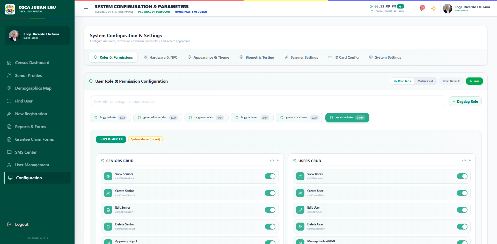 | **Configuration: Roles & Permissions** — RBAC (Role-Based Access Control) configuration na may granular permissions per role (Seniors CRUD, Users CRUD, etc.) para sa 6 na system roles. |
| 16 | 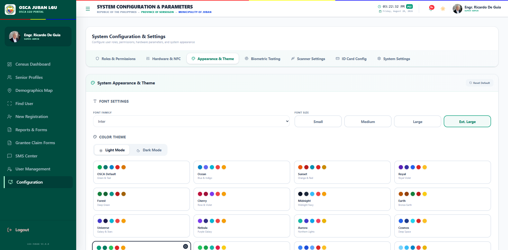 | **Configuration: Appearance & Theme** — System appearance settings kasama ang font family/size selection, color theme picker (12+ themes: OSCA Default, Ocean, Sunset, Royal, etc.), at light/dark mode toggle. |
| 17 | 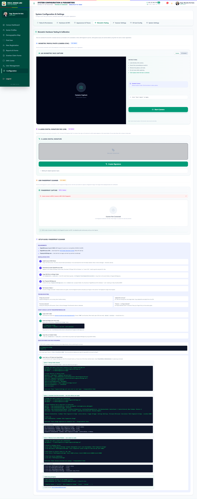 | **Configuration: Biometric Testing** — Hardware testing page para sa camera (face capture), E-Lagda digital signature pad, at USB fingerprint scanner, kasama ang setup guide at troubleshooting. |
| 18 | 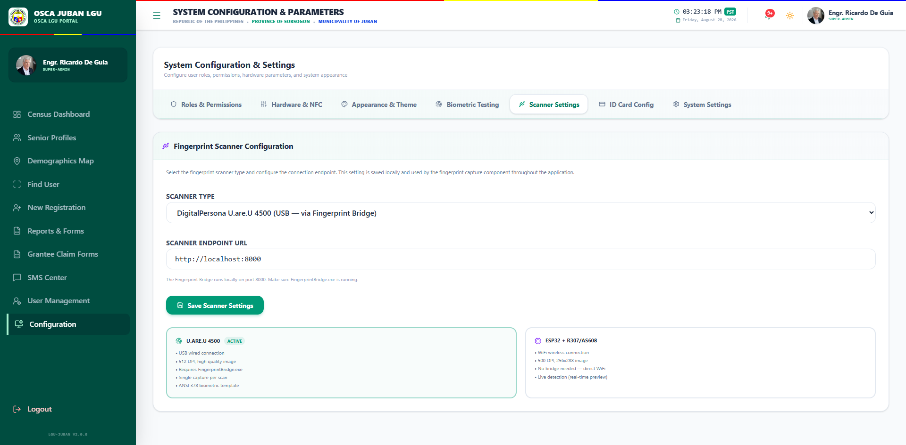 | **Configuration: Scanner Settings** — Fingerprint scanner configuration (DigitalPersona U.are.U 4500 USB at ESP32 + R307/AS608 WiFi) na may endpoint URL setup. |
| 19 | 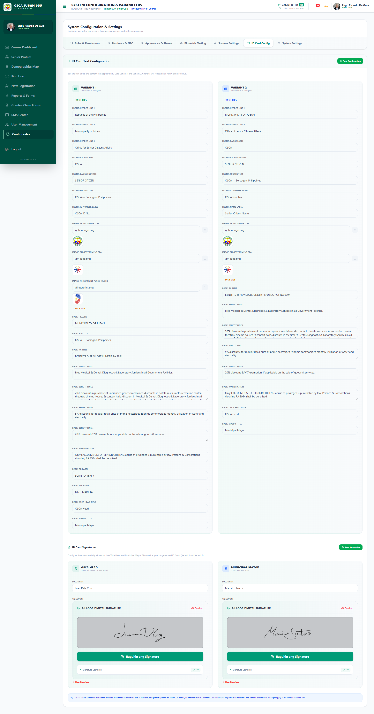 | **Configuration: ID Card Config** — NFC ID Card text configuration (Variant 1 & 2) kasama ang front/back side labels, benefits text, at ID Card Signatories (OSCA Head at Municipal Mayor) na may E-Lagda digital signatures. |
| 20 | 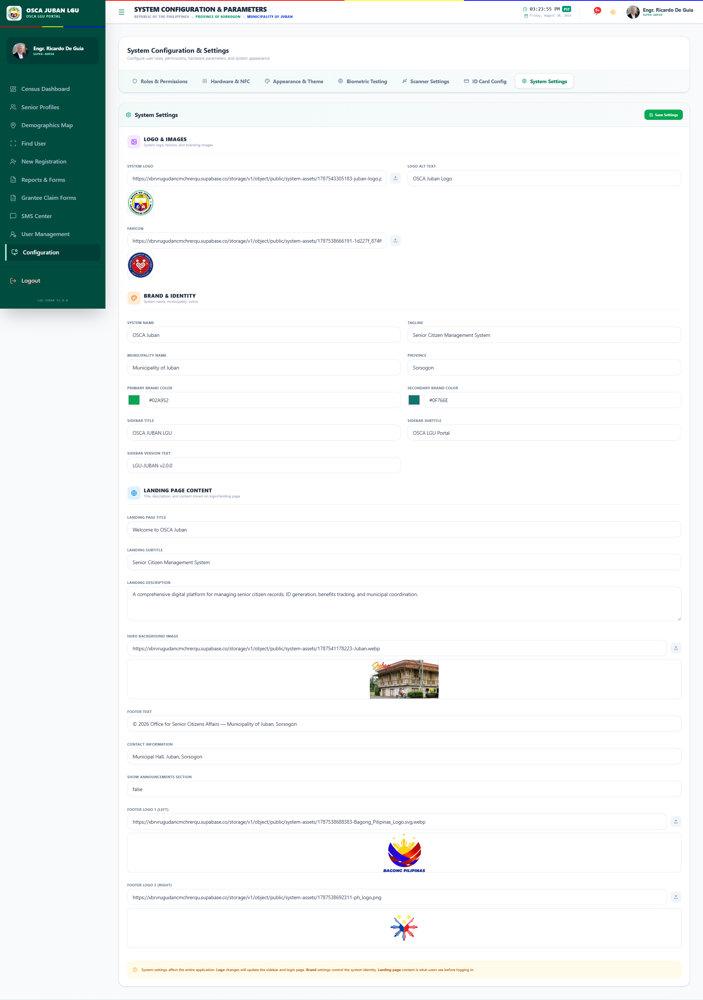 | **Configuration: System Settings** — Logo & Images, Brand & Identity (colors, tagline), Landing Page Content, Hero Background, Footer Logos, at Contact Information configuration. |

---

*Bayan ng Juban, Lalawigan ng Sorsogon — Office for Senior Citizens Affairs*
